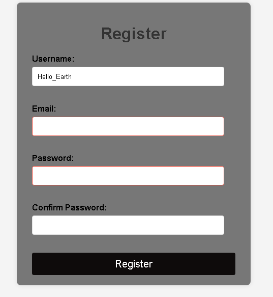

Project Overview:
This project is an interactive user registration form that validates input fields in real time using JavaScript and the Constraint Validation APIand stores yser name data in local storage

Features

Real-Time Validation: Provides instant feedback as the user types using the Constraint Validation API.
Custom Error Messages: Displays clear, user-friendly error messages beside each input field.
Password Confirmation: Ensures the “Confirm Password” field matches the original password.
Local Storage Integration: Saves and retrieves the username for future sessions.
Form Reset & Success Message: Displays a success alert on valid submission and resets the form.

Challengess
The main challenges were handling real-time validation for multiple fields and correctly displaying custom error messages beside each input.

AppApp files

index.html: Main HTML file
style.css:  Minimal CSS
script.js: Core app logic
README.md

Reflection

1. How did event.preventDefault() help in handling form submission?

event.preventDefault() stopped the form from automatically reloading the page when the user clicked Submit.
This allowed me to perform custom validation checks using JavaScript, show error messages, and only show a success alert once all fields were valid. But to understand ths concept it took more time 

2 2. What is the difference between using HTML5 validation attributes and JavaScript-based validation? Why might you use both?

HTML5 validation attributes (like required, pattern, minlength) provide basic built-in checks handled by the browser.

JavaScript validation adds flexibility to create custom rules, real-time feedback, and custom error messages.
Using both ensures strong, user-friendly validation — HTML5 handles simple checks, while JavaScript manages more dynamic and detailed validation.

3.3. Explain how you used localStorage to persist and retrieve the username. What are the limitations of localStorage for storing sensitive data?

I used localStorage.setItem('username', userName.value) to save the entered username and retrieved it with localStorage.getItem('username') to pre-fill the field when the page reloads.
However, localStorage is not secure — data is stored in plain text and can be accessed by anyone using the browser, so it should never store passwords or sensitive user information.

4. Describe a challenge you faced in implementing the real-time validation and how you solved it.

Initially, the error messages didn’t update correctly while typing.
I solved it by adding input event listeners for each field and dynamically displaying the input.validationMessage inside the corresponding .
This ensured immediate feedback as the user corrected their input.

5. How did you ensure that custom error messages were user-friendly and displayed at the appropriate times?

I used clear, specific messages for each field and placed them next to the inputs using linked  elements.
The script checked validity in real-time and updated or cleared messages instantly, so users always knew what to fix without confusion.